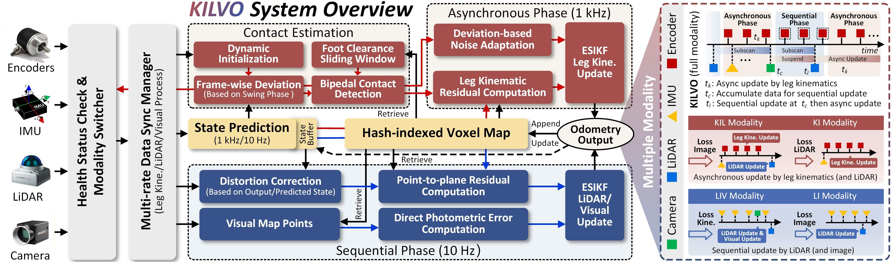

# KILVO

**Kinematic-Inertial-LiDAR-Visual Odometry with Robust Multimodal Adaptation for Humanoid Robots**

The paper and dataset are available, and the code will be released soon.

<a href="https://ieeexplore.ieee.org/document/11663305"></a>
<a href="https://arxiv.org/pdf/2608.05647v1"></a>
<a href="https://www.youtube.com/watch?v=rXk0EDo8RFU"></a>
<a href="https://wiki.ros.org/noetic/"></a>

## 1. Introduction
KILVO fully utilizes the sensors commonly equipped on humanoid robots, including joint encoders, IMU, LiDAR, and camera, within an asynchronous-sequential hybrid ESIKF. The inertial data are used for prediction, leg kinematics are processed asynchronously at a high rate, while exteroception is updated sequentially. The framework features multimodal adaptation to resist sensor failures and degradation. A compact contact estimation module is also integrated.

<div align=center>

</div>
<p align="center"> </p>

## 2. KILVO Dataset

### 2.1 Sensor Configuration

* **10 Hz LiDAR & 200 Hz IMU**: Livox Mid360, embedded in the G1 head.

  rostopic: `/livox/lidar`, `/livox/imu`

* **10 Hz Camera_1**: Realsense D455.

  rostopic: `/camera/color/image_raw`

* **10 Hz Camera_2**: Hikvision MV-CU013.

  rostopic: `/camera/image`

* **1 kHz Leg Kinematics**: The foot info in the LiDAR frame, calculated by leg kinematics based on the joint encoders.

  rostopic: `/g1/joint_state`

More details are provided in [dataset_info.md](./dataset_info.md).

### 2.2 Download

We have released a total of 15 sequences for humanoid robot SLAM in rosbag format. 

The sequences in the KILVO dataset can be downloaded from [OneDrive](https://1drv.ms/f/c/2E0069138F9E166E/IgCSBbkSo0qmQqyLiXgOYP_yAe_pTYyMJnpF1HG22t4NnVs?e=AAccdg).

## Citation

Our paper is accepted by IEEE TMECH 2026.
If you find this work useful for your research, please consider citing:

```bibtex
@ARTICLE{gao2026kilvo,
  author={Gao, Jixin and Liu, Fucheng and Zhang, Teng and Zha, Fusheng},
  journal={IEEE/ASME Transactions on Mechatronics}, 
  title={KILVO: Kinematic–Inertial–LiDAR–Visual Odometry With Robust Multimodal Adaptation for Humanoid Robots}, 
  year={2026},
  volume={},
  number={},
  pages={1-12},
  doi={10.1109/TMECH.2026.3721778}}
```

## Acknowledgments

We thank the [HKU-Mars-Lab](https://github.com/hku-mars) for their contributions to the community. Their work has provided an important foundation and inspiration for our research.
