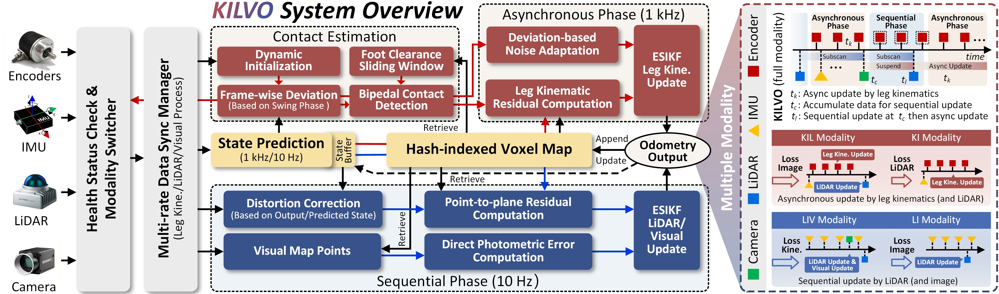

# KILVO

**Kinematic-Inertial-LiDAR-Visual Odometry with Robust Multimodal Adaptation for Humanoid Robots**

<a href="https://ieeexplore.ieee.org/document/11663305"></a>
<a href="https://arxiv.org/pdf/2608.05647v1"></a>
<a href="https://www.youtube.com/watch?v=rXk0EDo8RFU"></a>
<a href="https://wiki.ros.org/noetic/"></a>

## 1. Introduction
KILVO fully utilizes the sensors commonly equipped on humanoid robots, including joint encoders, IMU, LiDAR, and camera, within an asynchronous-sequential hybrid ESIKF. The inertial data are used for prediction, leg kinematics are processed asynchronously at a high rate, while exteroception is updated sequentially. The framework features multimodal adaptation to resist sensor failures and degradation. A compact contact estimation module is also integrated.

<div align=center>

</div>
<p align="center"> </p>

## 2. KILVO Dataset

### 2.1 Sensor Configuration

* **10 Hz LiDAR & 200 Hz IMU**: Livox Mid360, embedded in the G1 head.

  rostopic: `/livox/lidar`, `/livox/imu`

* **10 Hz Camera_1**: Realsense D455.

  rostopic: `/camera/color/image_raw`

* **10 Hz Camera_2**: Hikvision MV-CU013.

  rostopic: `/camera/image`

* **1 kHz Leg Kinematics**: The foot info in the LiDAR frame, calculated by leg kinematics based on the joint encoders.

  rostopic: `/g1/joint_state`

More details are provided in [dataset_info.md](./dataset_info.md).

### 2.2 Download

We have released a total of 15 sequences for humanoid robot SLAM in rosbag format. 

The sequences in the KILVO dataset can be downloaded from [OneDrive](https://1drv.ms/f/c/2E0069138F9E166E/IgCSBbkSo0qmQqyLiXgOYP_yAe_pTYyMJnpF1HG22t4NnVs?e=AAccdg).

## 3. Prerequisites

### 3.1 Ubuntu and ROS

Our code is tested on Ubuntu 20.04 with [ROS Noetic](https://wiki.ros.org/noetic).

### 3.2 PCL, Eigen and OpenCV

Eigen>=3.3.4, Follow [Eigen Installation](https://eigen.tuxfamily.org/index.php?title=Main_Page).

OpenCV>=4.2, Follow [OpenCV Installation](https://opencv.org/).

PCL>=1.8, Follow [PCL Installation](https://pointclouds.org/).

For Ubuntu 20.04, the default PCL and Eigen are enough to work normally.

### 3.3 Sophus and Vikit

[Sophus Installation](https://github.com/strasdat/Sophus) for the non-templated/double-only version.

```bash
git clone https://github.com/strasdat/Sophus.git
cd Sophus
git checkout a621ff
mkdir build && cd build && cmake ..
make
sudo make install
```

KILVO uses the [Vikit](https://github.com/xuankuzcr/rpg_vikit) from FAST-LIVO2 for camera models and mathematical utilities.

```bash
cd catkin_ws/src
git clone https://github.com/xuankuzcr/rpg_vikit.git
```

## 4. Build

Clone KILVO into the catkin workspace:

```bash
cd catkin_ws/src
git clone https://github.com/JixinGao/KILVO
cd ../
catkin_make
source devel/setup.bash
```

## 5. Run

### 5.1 Run on KILVO's Dataset

Download a sequence from [Section 2.2](#22-download) and select the launch file.
The launch files load the corresponding camera intrinsics and sensor configuration automatically.


**Realsense D455**

```bash
roslaunch kilvo mapping_mid360_d455i.launch
rosbag play YOUR_DOWNLOADED.bag
```

**Hikvision MVS**

```bash
roslaunch kilvo mapping_mid360_mvs.launch
rosbag play YOUR_DOWNLOADED.bag
```

- To disable contact visualization, comment out the line that launches `plot_rt.py` in the launch file. The script requires `python3-numpy` and `python3-matplotlib`.

### 5.2 Run on other Dataset

Configure the enabled sensors according to your setup and verify ROS topics. Set `en_auto_mode` to enable or disable adaptive modality switching during KILVO operation. Update the camera intrinsics and sensor extrinsics for your own setup.

An example for [LIKO dataset](https://github.com/Mr-Zqr/LIKO) is provided in [`liko_dataset.yaml`](config/liko_dataset.yaml) and [`mapping_liko.launch`](launch/mapping_liko.launch).

## Citation

Our paper is published by IEEE TMECH 2026.
If you find this work useful for your research, please consider citing:

```bibtex
@ARTICLE{gao2026kilvo,
  author={Gao, Jixin and Liu, Fucheng and Zhang, Teng and Zha, Fusheng},
  journal={IEEE/ASME Transactions on Mechatronics}, 
  title={KILVO: Kinematic–Inertial–LiDAR–Visual Odometry With Robust Multimodal Adaptation for Humanoid Robots}, 
  year={2026},
  volume={},
  number={},
  pages={1-12},
  doi={10.1109/TMECH.2026.3721778}}
```

## Acknowledgments

We thank the [HKU-Mars-Lab](https://github.com/hku-mars) for their contributions to the community. Their work has provided an important foundation and inspiration for our research.
