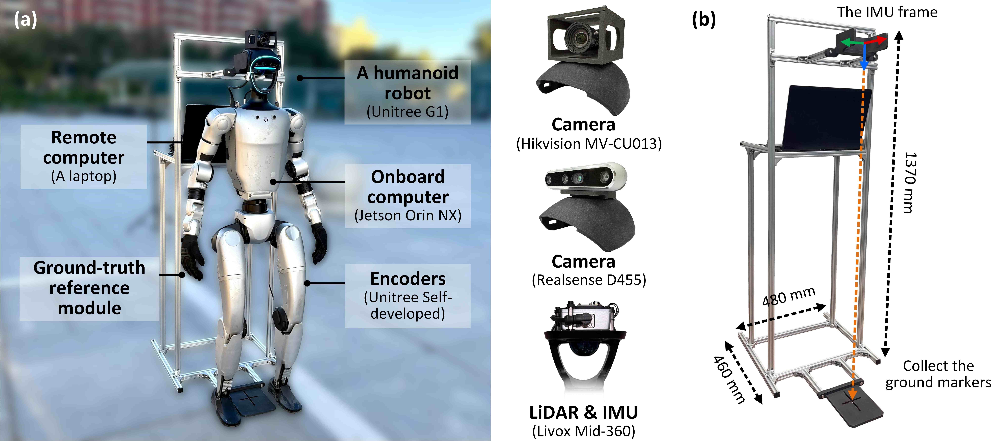

# Self-collected Dataset

We collected a multimodal dataset using a Unitree G1 humanoid robot. The dataset contains data from LiDAR, camera, leg kinematics, and IMU, comprising a total of 15 sequences across indoor and outdoor environments.

<div align=center>

</div>
<p align="center"> </p>

# Calibration
## Camera Intrinsics

Realsense D455:
```
width*height: 1280*720
[fx, fy, cx, cy, d0, d1, d2, d3]:
[623.86738, 623.51753, 655.14238, 355.73246, -0.055818, 0.031008, -0.001357, 0.001668]
```
MVS CU013:
```
width*height: 1280*1024
[fx, fy, cx, cy, d0, d1, d2, d3]:
[1284.05029, 1285.91764, 620.34018, 472.92702, -0.096425, 0.136829, -0.006561, -0.001269]
```

## Extrinsic Calibration
`Rcl, pcl`: LiDAR frame w.r.t. Camera frame

| Frame | Rcl | Pcl |
| --- | :---: | :---: |
| `Mid360`-> `Realsense` | [0.001873 0.999987 0.004806 <br> -0.026643 -0.004754 0.999634 <br> 0.999643 -0.002001 0.026634] | [0.038862, 0.120302, -0.121405] |
| `Mid360`->`MVS` | [0.021566 0.999765 0.002211 <br> 0.009657 -0.002419 0.999951 <br> 0.999721 -0.021544 -0.009706] | [0.040325, 0.096927, -0.065726] |

# Ground Truth
We use the mechanical module to manually record the start and end positions, obtaining the relative end-to-end error as the ground truth.

| Sequence | Start-to-End Distances (m) |
| --- | :---: |
| `corridor_r01` | 0.3119647416 |
| `spin_r01` | 0.3130910570 |
| `outdoor_r01` | 1.0249732923 |
| `outdoor_r02` | 0.9197315165 |
| `outdoor_r03` | 0.0589074698 |
| `corridor_h01` | 0.4808443095 |
| `spin_h01` | 0.1103217114 |
| `outdoor_h01` | 0.1721647176 |
| `outdoor_h02` | 0.1352479205 |
| `outdoor_h03` | 0.4331246934 |
| `outdoor_h04` | 0.2312249986 |
| `run_h01` | 0.6220669176 |
| `run_h02` | 0.4091014544 |
| `robust_h01` | 0.2528792004 |
| `robust_h02` | 0.1502131818 |
